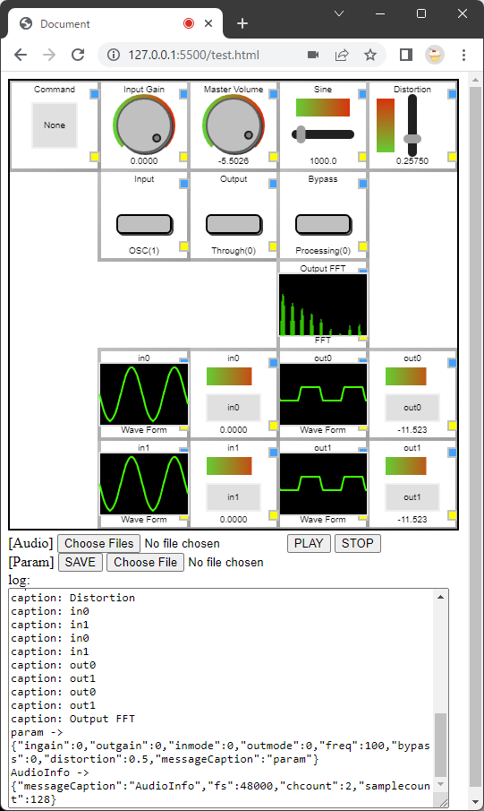
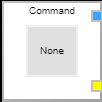

# jsasp

### main view

## 1. What you can do  
Audio processing can be performed using the Web Audio API on a Web browser. You can also operate using control parts placed on Canvas as a GUI operation. It has the following functions.
  - Play audio files
  - Playback of microphone and audio I/F input
  - Sine wave or white noise output (input side and output side)
  - Signal processing for 2ch for input signal (distortion sample)

## 2. Composition  
Compsition of files.
  - index.js : For Electron. Not required for web testing
  - test.html : GUI canvas, audio file selection, preset save/restore setting example
  - js
    - audio-parts.js : Audio function parts
    - gui-parts.js : GUI function parts
    - gui-parts.json.js : Configuration file for GUI parts
    - jsasp-processor.js : Audio signal processing module
    - main.js : Definition of various setting functions

## 3. build(Electron)  
Generate an Electron-based app for X86 with electron-build.sh.  

## 4. Description of signal processing  
Arbitrary signal processing and parameters can be added by changing jsasp-processor.js and main.js.  
  - jsasp-processor.js  
    - Write signal processing in process_main. ch0/ch1 are usually Lch/Rch. Since the audio frame size is usually 128 data (float) units, the signal processing is described as follows.  
      ~~~
      function process_main(ch0, ch1, info, param)
      {
        let trim = 0.5;  /* -6.02dB trim for all channels */
        for (let i = 0; i < info.samplecount; ++i) {
          ch0[i] *= trim;
          ch1[i] *= trim;
        }
      }
      ~~~
    - Parameters can be specified by setting them in jsaspParam. For example, to change the trim value in conjunction with the sampling frequency, set as follows.  
      ~~~
      /* jsasp param */
      const jsaspParam = {
          'ingain': 0.0,
          'outgain': 0.0,
          'inmode': 0.0,
          'outmode': 0.0,
          'freq': 100.0,

          // For Signal Processing
          'gainFor44k' : 0.78,
          'gainFor48k' : 0.5,
      };

      function process_main(ch0, ch1, info, param)
      {
        let fsgain = 0.0;
        if(info.fs === 44100) {
          fsgain = param.gainFor44k;
        }
        if(info.fs === 48000) {
          fsgain = param.gainFor48k;
        }
        for (let i = 0; i < info.samplecount; ++i) {
          ch0[i] *= fsgain;
          ch1[i] *= fsgain;
        }
      }
      ~~~
  - main.js  
    - In main,js, parameters can be set from GUI control to the signal processing part.  
    - The simplest way is to send the parameters with the command.  
      - Send command by clicking Command in GUI  
      

      ~~~
      PUT gainFor44k 0.75  
      GET gainFor48k (The current value will display on log view.)
      ~~~

## 5. Further customization  
GUI parts can be placed on canvas with gui-parts.json.js. The behavior when operating the placed parts can be described with the jsaspSetParam function of main.js.  
  - gui-parts.json.js  
    The following can be set as GUI parts  
    - text :  
      Parameters: 'valLabel' default value of label, 'valPrompt' Commnent on Prompt  
      On Click on blue button: n/a  
      On Click on yellow button: n/a  
      On Click on controller: View Prompt  
      Get Value: Current value of 'valLabel'.  
      Explain: Simple text display. On click inside box, you can modify 'valLabel' on prompt.  
    - switch :  
      Parameters: 'valMin' minimum value, 'valMax' maximum value, 'valLabel' labels corresponding to numbers, 'valInit' default value  
      On Click on blue button: freeze/unfreeze current value  
      On Click on yellow button: Set value directly  
      On Click on controller: count up the value  
      Get Value: Current value.  
      Explain: Count up button. When the value reachs to the maximum value, it wraps back to the minimum value.  
    - slide_v :  
      Parameters: 'valMin' minimum value, 'valMax' maximum value, 'valInit' default value  
      On Click on blue button: freeze/unfreeze current value  
      On Click on yellow button: Set value directly  
      On Click on controller: The value changes corresponding to slide controller.  
      Get Value: Current value.  
      Explain: Vertical slide controller.  
    - slide_h :  
      Parameters: 'valMin' minimum value, 'valMax' maximum value, 'valInit' default value  
      On Click on blue button: freeze/unfreeze current value  
      On Click on yellow button: Set value directly  
      On Click on controller: The value changes corresponding to slide controller.  
      Get Value: Current value.  
      Explain: Horizontal slide controller.  
    - nob :  
      Parameters: 'valMin' minimum value, 'valMax' maximum value, 'valInit' default value  
      On Click on blue button: freeze/unfreeze current value  
      On Click on yellow button: Set value directly  
      On Click on controller: The value changes corresponding to nob controller.  
      Get Value: Current value.  
      Explain: Rotary nob controller.  
    - meter_h :  
      Parameters: 'valMin' minimum value of view, 'valMax' maximum value of view, 'valLabel' label on display  
      On Click on blue button: n/a  
      On Click on yellow button: n/a  
      On Click on controller: n/a  
      Set Value: Current value of view (float).  
      Explain: View the meter of set value.  
    - disp :  
      Parameters: 'valObj' obj for display wave form  
      On Click on blue button: n/a  
      On Click on yellow button: n/a  
      On Click on controller: n/a  
      Set Value: n/a  
      Explain: View the wave form of 'valObj'.  
    - fft :  
      Parameters: 'valObj' obj for display FFT power spectrum  
      On Click on blue button: n/a  
      On Click on yellow button: n/a  
      On Click on controller: n/a  
      Set Value: n/a  
      Explain: View the FFT of 'valObj'.  
  - main.js  
    "jsaspSetParam" is called when the user controls each part of the GUI. Argument num is same as the order number of jsaspGuiData. (Please refer to jsaspSetParam function)
